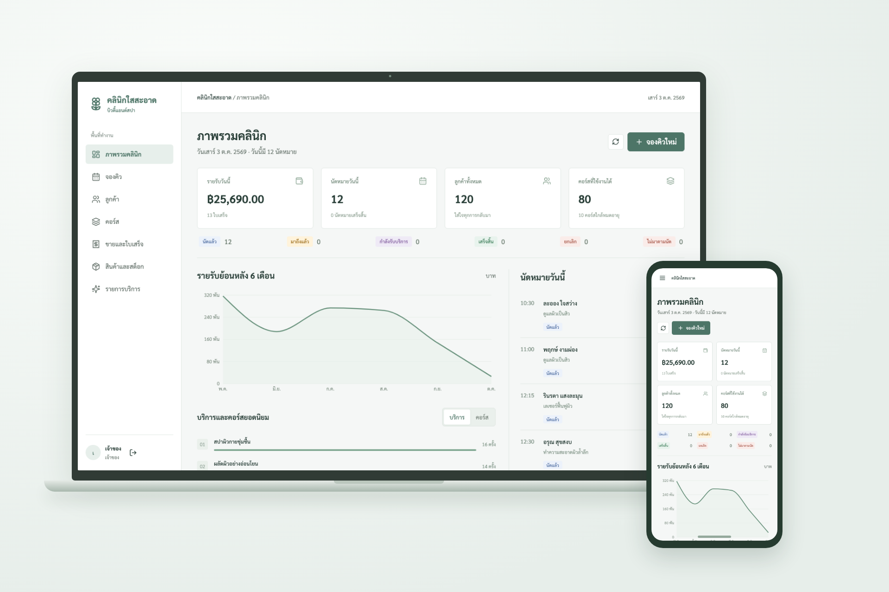
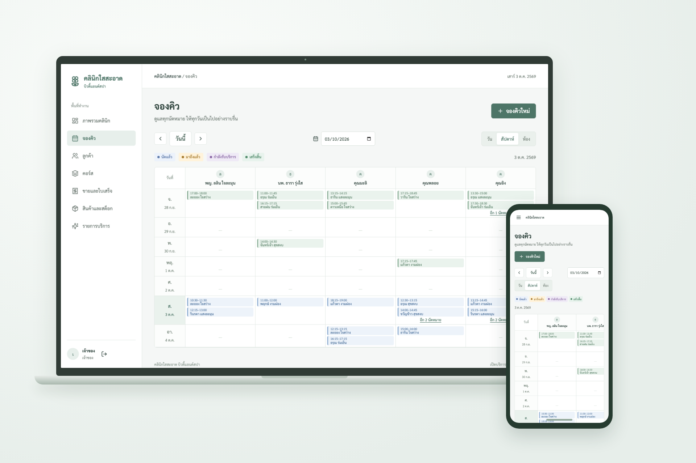
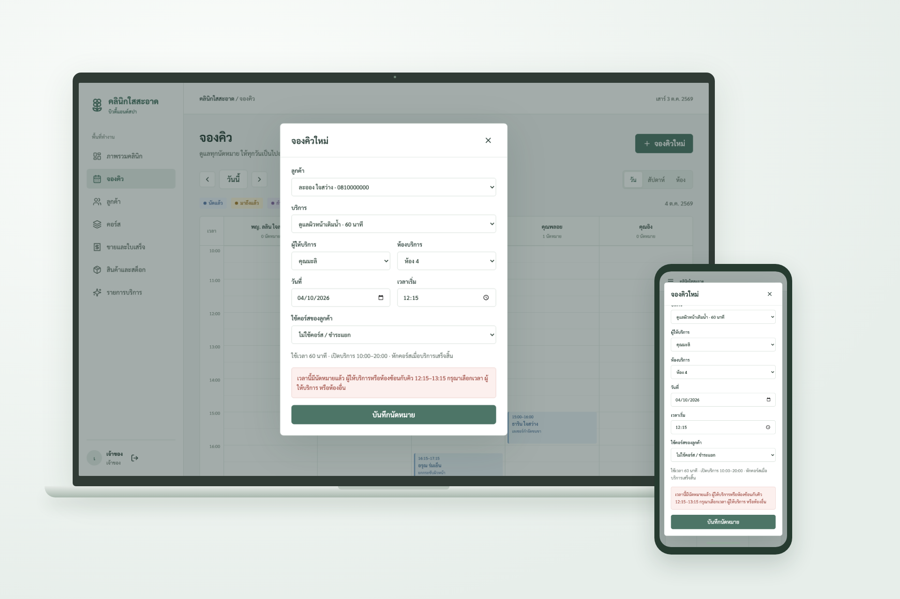
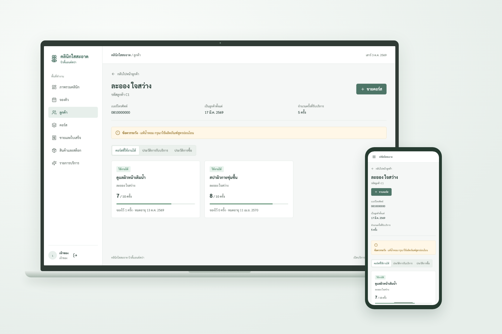
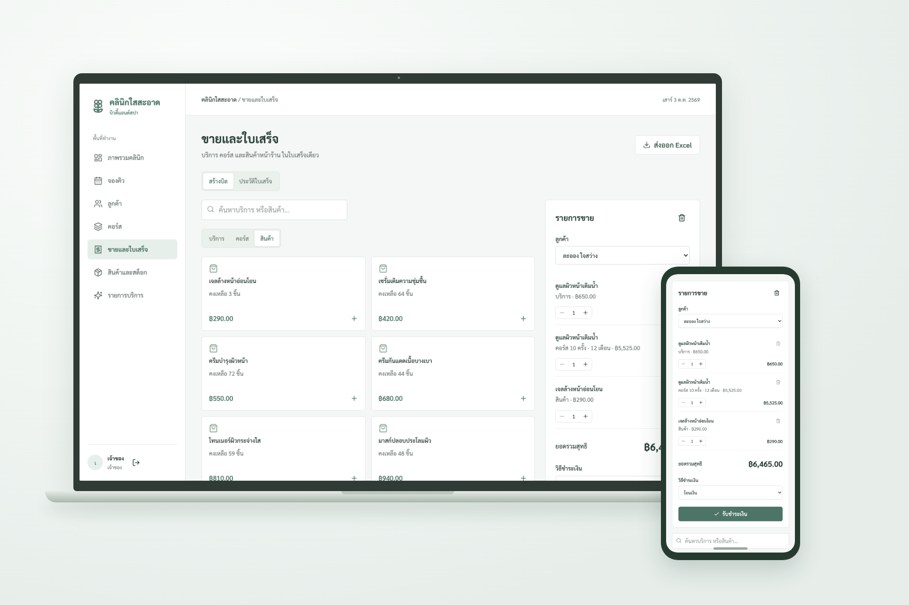
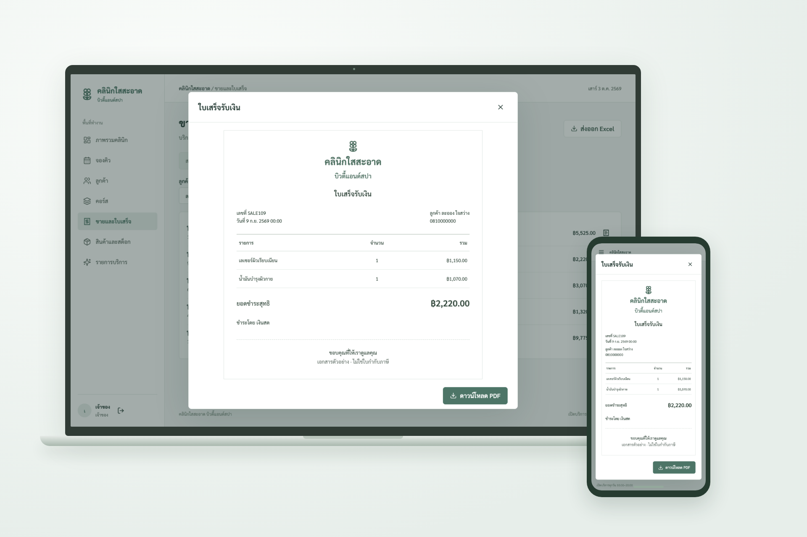
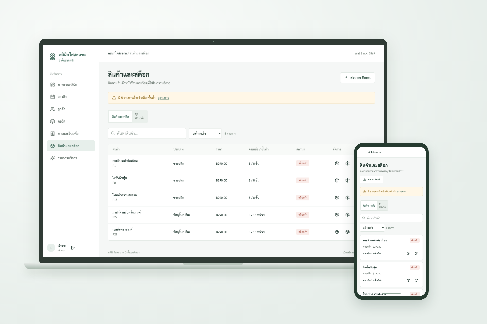
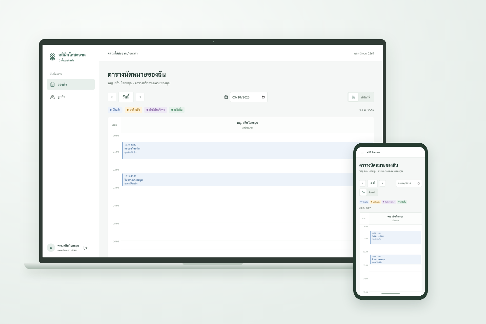

# คลินิกใสสะอาด บิวตี้แอนด์สปา

A fictional Thai beauty clinic back-office portfolio demo. Frontend only, with a
transactional mock service ready to be replaced by a Spring Boot REST adapter.

**Live demo:** `https://<github-username>.github.io/beauty-clinic/`

## Run locally

Node 22.19+ and npm. Install, test and run:

```sh
npm ci
npm run dev
npm run build
npm run lint
npm test
npx playwright install chromium
npm run check:browser
npm run screenshots
npm run gallery
```

Open the URL printed by Vite, including `/beauty-clinic/`. Demo credentials are
prefilled: `demo@clinic.test` / `demo1234`. Choose owner, reception or practitioner.
Use a free port, for example `npm run dev -- --port 5187 --strictPort`.

## Features

- Owner dashboard: daily revenue/statuses, six-month revenue, popular services,
  expiring courses, idle course customers and low-stock items.
- Day/week practitioner calendars, room calendar, booking/edit/reschedule and
  status progression. Practitioner and room overlap/opening-hours validation.
- Customer search, visit/purchase history, role-protected precautions.
- Course sales, session reservations, expiry and usage history. Sessions and
  consumables are deducted atomically only on completion.
- Mixed treatment/course/product checkout, cash/transfer/card, Thai receipt
  preview and downloadable PDF. Actual XLSX exports for sales and stock.
- Inventory receipts/issues and movement history; stock cannot go negative.
- Mobile drawer, card lists, loading skeletons, empty states, confirmations,
  toasts and screenshot mode (`?screenshot=1` before or after the hash).

## Stack and structure

React 19, TypeScript, Vite, HashRouter, Tailwind CSS 4, source-owned shadcn/ui
primitives (Radix + CVA), Recharts, lucide-react, date-fns, self-hosted Sarabun,
ExcelJS, jsPDF/html2canvas, Vitest and Playwright.

[Architecture](docs/ARCHITECTURE.md) defines routes, domain, service contracts,
transactions and permissions. [Decisions](docs/DECISIONS.md) records assumptions.
UI never reads localStorage or seed data directly; all access is through services.
Currency uses integer satang; displayed dates use Thai month names and Buddhist years.

## Demo limitations

**All business, customer and staff data is fictional. This is not a medical record
system or production authentication. Do not enter real personal or medical data.**
State persists in this browser's localStorage for the current local day. On the
next day the dated fixtures regenerate so the demo stays current; owner can also
reset via the dashboard. Initial data includes 120 customers, 25 treatments,
30 products, 80 course purchases and roughly 540 historical/upcoming appointments.
Historical completed visits are fixtures; stock is a present-day opening balance.
The receipt PDF is a rasterized demo receipt, not a tax invoice. PDF and Excel
libraries load on demand. The ExcelJS chunk is large but not on the initial path.
Fake auth and local persistence are not security boundaries against developer tools.

For a real Spring Boot project implement `ClinicService` in `src/services`, select
it in the factory/bootstrap, and move authorization and transactional constraints
to the server. All data must be server-authorized; never trust browser roles.

## Deploy

1. Create a GitHub repository named `beauty-clinic`, add its remote and push `main`.
2. In Settings > Pages select **GitHub Actions** as the source.
3. The supplied workflow installs, lints, builds and deploys `dist`.
4. Replace the live demo placeholder above. If renaming the repository, update
   Vite's base and screenshot helper URL to match.

## ภาษาไทย

ระบบตัวอย่างงานหลังบ้านสำหรับ **คลินิกใสสะอาด บิวตี้แอนด์สปา** มีระบบจองคิว
ลูกค้า คอร์ส ขายและใบเสร็จ สต็อกสินค้า และภาพรวมรายรับ ออกแบบให้ใช้งานได้ทั้ง
หน้าจอคอมพิวเตอร์และโทรศัพท์ ข้อมูลทั้งหมดเป็นข้อมูลสมมติ ไม่มีระบบหลังบ้านจริง
และไม่ควรกรอกข้อมูลส่วนบุคคลหรือข้อมูลสุขภาพจริง

เข้าใช้งานด้วย `demo@clinic.test` / `demo1234` และเลือกบทบาท เจ้าของเห็นทุกหน้า
พนักงานต้อนรับจัดการจองคิว ลูกค้า คอร์ส และการขาย แต่ไม่เห็นรายงานรายรับหรือ
ข้อควรระวัง แพทย์/เทอราพิสต์เห็นเฉพาะคิวของตน ประวัติการดูแลและข้อควรระวังของ
ลูกค้าที่นัดกับตน โดยไม่เห็นราคาหรือรายการขาย

บันทึกข้อมูลไว้ในเบราว์เซอร์สำหรับวันปัจจุบัน และคืนข้อมูลสมมติในวันถัดไป
ใช้ `npm run screenshots` เพื่อสร้างภาพเดสก์ท็อปและมือถือ และ `npm run gallery`
เพื่อประกอบภาพแล็ปท็อปกับโทรศัพท์ ใบเสร็จ PDF เป็นเอกสารตัวอย่าง ไม่ใช่ใบกำกับภาษี

## Gallery

[Capture index](docs/screenshots/README.md) · [Exact file manifest](docs/screenshots/manifest.json) · [Delivery report and verification checklist](docs/DELIVERY.md)

22 source screenshots and 11 laptop/phone compositions. All requested scenarios
captured cleanly. Set `GALLERY_WIDTH` / `GALLERY_HEIGHT` to change composition size.










Additional compositions: [day appointments](docs/screenshots/gallery/appointments-day.png),
[room calendar](docs/screenshots/gallery/appointments-room.png),
[courses](docs/screenshots/gallery/courses.png).
